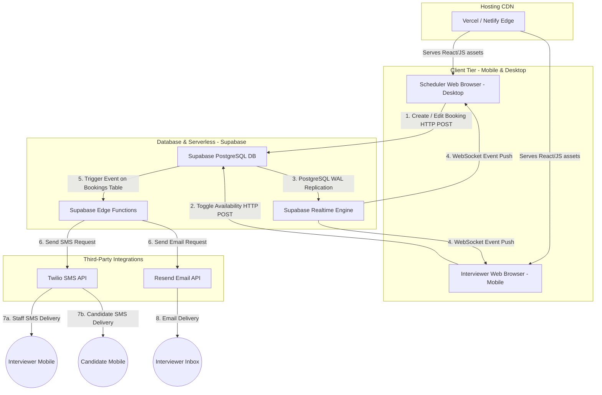

# Architecture Diagram & Data Flow

---

## 1. Overview
The Shea Post Acute scheduling application uses a modern **Serverless/BaaS (Backend-as-a-Service)** architecture, pairing a Single Page Application (SPA) on the client side with Supabase on the cloud. This avoids server provisioning costs, enables instant real-time synchronization, and eliminates licensing fees.

---

## 2. Mermaid Architecture Diagram

---

## 3. Data Flow Steps

### A. Scheduling Flow
1. **Booking Trigger**: A scheduler logs into the dashboard via desktop, checks availability, and submits a candidate booking for a Nurse Interviewer.
2. **Database Write**: The client sends an HTTPS request to the Supabase client API. RLS policies verify the facility session and save the booking.
3. **Database Change Capture**: The PostgreSQL database captures the insert in its Write-Ahead Log (WAL).

### B. Real-Time Sync Flow
4. **WebSocket Broadcast**: The Supabase Realtime Engine reads the WAL change and pushes a JSON event payload over WebSocket channels (`public:bookings`).
5. **UI Update**: All active frontend clients receive the event payload. The React state updates immediately, turning the grid slot red and showing the candidate name without page refresh.

### C. Notification Dispatch Flow
6. **Trigger Invocation**: A database trigger on `bookings` detects a new booking, status update (e.g. candidate arrival), or cancellation, and invokes a Deno-based Supabase Edge Function asynchronously.
7. **External Calls**: The Edge Function resolves the interviewer's and/or candidate's contact details, formats the template, and makes outbound API calls to Twilio (SMS) and Resend (Email).
8. **Worker & Candidate Notification**: 
   * The interviewer receives the text alert and email on their phone, notifying them of the upcoming interview or lobby arrival.
   * If opt-in is enabled, the candidate receives an automated text confirmation.
