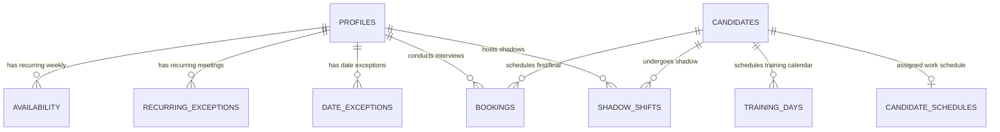

# System Requirements Document (SRD): Shea Scheduling

---

## 1. Technology Stack
* **Frontend**: Vite + React (TypeScript) + Tailwind CSS + Vite PWA Plugin.
* **Database & Real-time**: Supabase (PostgreSQL with real-time replication enabled).
* **Authentication**: Supabase Auth (Free tier).
* **Notifications**: Resend API (Email) + Twilio API (SMS) executed via Supabase Edge Functions.
* **Hosting**: Vercel or Netlify (Free tier).

---

## 2. Platform Architecture: Progressive Web App (PWA)
To run across Windows, macOS, Linux, iOS, and Android for free without compiling separate native apps or paying app store developer licensing fees, the app is built as a **Progressive Web App (PWA)**:
* **Service Workers**: Caches assets locally so the app loads instantly, even in dead zones on the SNF floor.
* **Web App Manifest**: Enables mobile and desktop operating systems to "Install" the web app directly to their home screens, dock, or taskbars, complete with a custom app icon and full-screen display.
* **Single Codebase**: Built once in React/TypeScript, running in the native web rendering engine of the device.

---

## 3. Database Schema Design (PostgreSQL)



### Table DDL with soft delete, log, and training days tracking

```sql
-- 1. Profiles Table
CREATE TABLE profiles (
    id UUID PRIMARY KEY REFERENCES auth.users(id) ON DELETE CASCADE,
    name VARCHAR(100) NOT NULL,
    role VARCHAR(20) CHECK (role IN ('CNA', 'Nurse', 'Scheduler', 'Floor Staff')),
    title VARCHAR(50) NOT NULL,
    email VARCHAR(255) UNIQUE NOT NULL,
    phone VARCHAR(20),
    pin VARCHAR(4),
    mute_notifications BOOLEAN DEFAULT FALSE NOT NULL, -- Setting to mute web audio chimes
    is_deleted BOOLEAN DEFAULT FALSE NOT NULL,
    deleted_at TIMESTAMP WITH TIME ZONE,
    deleted_by VARCHAR(100),
    recovered_at TIMESTAMP WITH TIME ZONE,
    recovered_by VARCHAR(100),
    created_at TIMESTAMP WITH TIME ZONE DEFAULT timezone('utc'::text, now()) NOT NULL
);

-- 2. Availability Table (Recurring Weekly Availability)
CREATE TABLE availability (
    id UUID PRIMARY KEY DEFAULT gen_random_uuid(),
    profile_id UUID REFERENCES profiles(id) ON DELETE CASCADE NOT NULL,
    day_of_week INT CHECK (day_of_week BETWEEN 1 AND 7) NOT NULL, -- 1=Monday, 7=Sunday
    start_time TIME NOT NULL,
    end_time TIME NOT NULL,
    created_at TIMESTAMP WITH TIME ZONE DEFAULT timezone('utc'::text, now()) NOT NULL
);

-- 3. Recurring Exceptions Table (Weekly recurrent busy blocks, e.g. UR meetings)
CREATE TABLE recurring_exceptions (
    id UUID PRIMARY KEY DEFAULT gen_random_uuid(),
    profile_id UUID REFERENCES profiles(id) ON DELETE CASCADE NOT NULL,
    day_of_week INT CHECK (day_of_week BETWEEN 1 AND 7) NOT NULL,
    start_time TIME NOT NULL,
    end_time TIME NOT NULL,
    reason VARCHAR(255) NOT NULL,
    created_at TIMESTAMP WITH TIME ZONE DEFAULT timezone('utc'::text, now()) NOT NULL
);

-- 4. Date Exceptions Table (One-off busy dates)
CREATE TABLE date_exceptions (
    id UUID PRIMARY KEY DEFAULT gen_random_uuid(),
    profile_id UUID REFERENCES profiles(id) ON DELETE CASCADE NOT NULL,
    exception_date DATE NOT NULL,
    start_time TIME, -- If null, blocked all day
    end_time TIME,
    reason VARCHAR(255) NOT NULL,
    is_deleted BOOLEAN DEFAULT FALSE NOT NULL,
    deleted_at TIMESTAMP WITH TIME ZONE,
    deleted_by VARCHAR(100),
    recovered_at TIMESTAMP WITH TIME ZONE,
    recovered_by VARCHAR(100),
    created_at TIMESTAMP WITH TIME ZONE DEFAULT timezone('utc'::text, now()) NOT NULL
);

-- 5. Candidates Table
CREATE TABLE candidates (
    id UUID PRIMARY KEY DEFAULT gen_random_uuid(),
    name VARCHAR(100) NOT NULL,
    phone VARCHAR(20),
    email VARCHAR(255),
    position VARCHAR(20) CHECK (position IN ('CNA', 'Nurse')) NOT NULL,
    desired_shift VARCHAR(20) CHECK (desired_shift IN ('Day', 'Evening', 'Night')) NOT NULL DEFAULT 'Day', -- Match target shift needs
    punctuality VARCHAR(20) CHECK (punctuality IN ('On Time', 'Late', 'No Show')),
    referral_source VARCHAR(100),
    desired_wage VARCHAR(30),
    description TEXT,
    pipeline_stage VARCHAR(20) CHECK (pipeline_stage IN ('First_Interview', 'Shadow_Shift', 'Final_Interview', 'Training', 'Employed', 'Rejected')) DEFAULT 'First_Interview' NOT NULL,
    hiring_outcome VARCHAR(30) CHECK (hiring_outcome IN ('Recommended', 'Rejected', 'Pending_Feedback', 'Candidate_Withdrew', 'Employed', 'In_Training')),
    is_deleted BOOLEAN DEFAULT FALSE NOT NULL,
    deleted_at TIMESTAMP WITH TIME ZONE,
    deleted_by VARCHAR(100),
    recovered_at TIMESTAMP WITH TIME ZONE,
    recovered_by VARCHAR(100),
    created_at TIMESTAMP WITH TIME ZONE DEFAULT timezone('utc'::text, now()) NOT NULL
);

-- 6. Bookings Table (Interviews)
CREATE TABLE bookings (
    id UUID PRIMARY KEY DEFAULT gen_random_uuid(),
    interviewer_id UUID REFERENCES profiles(id) ON DELETE CASCADE NOT NULL,
    candidate_id UUID REFERENCES candidates(id) ON DELETE CASCADE NOT NULL,
    interview_time TIME NOT NULL,
    interview_date DATE NOT NULL,
    actual_start_time TIME,
    actual_end_time TIME,
    duration_minutes INT,
    notes TEXT,
    status VARCHAR(20) CHECK (status IN ('Scheduled', 'Arrived', 'Walk-In', 'Completed', 'Cancelled')) DEFAULT 'Scheduled' NOT NULL,
    send_candidate_sms BOOLEAN DEFAULT TRUE NOT NULL,
    overbooked_acknowledged_by VARCHAR(100),
    unavailable_override_acknowledged_by VARCHAR(100),
    is_deleted BOOLEAN DEFAULT FALSE NOT NULL,
    deleted_at TIMESTAMP WITH TIME ZONE,
    deleted_by VARCHAR(100),
    recovered_at TIMESTAMP WITH TIME ZONE,
    recovered_by VARCHAR(100),
    created_at TIMESTAMP WITH TIME ZONE DEFAULT timezone('utc'::text, now()) NOT NULL
);

-- 7. Shadow Shifts Table
CREATE TABLE shadow_shifts (
    id UUID PRIMARY KEY DEFAULT gen_random_uuid(),
    candidate_id UUID REFERENCES candidates(id) ON DELETE CASCADE NOT NULL,
    floor_staff_id UUID REFERENCES profiles(id) ON DELETE SET NULL,
    write_in_host_name VARCHAR(100),
    shift_date DATE NOT NULL,
    shift_type VARCHAR(20) CHECK (shift_type IN ('Day', 'Evening', 'Night')) NOT NULL,
    skills_rating INT CHECK (skills_rating BETWEEN 1 AND 5),
    attitude_rating INT CHECK (attitude_rating BETWEEN 1 AND 5),
    recommend_hire BOOLEAN,
    notes TEXT,
    status VARCHAR(20) CHECK (status IN ('Scheduled', 'Completed', 'Cancelled')) DEFAULT 'Scheduled' NOT NULL,
    double_shadow_acknowledged_by VARCHAR(100),
    off_duty_override_acknowledged_by VARCHAR(100), -- Track host off-duty exceptions overrides
    is_deleted BOOLEAN DEFAULT FALSE NOT NULL,
    deleted_at TIMESTAMP WITH TIME ZONE,
    deleted_by VARCHAR(100),
    recovered_at TIMESTAMP WITH TIME ZONE,
    recovered_by VARCHAR(100),
    created_at TIMESTAMP WITH TIME ZONE DEFAULT timezone('utc'::text, now()) NOT NULL
);

-- 8. Individual Training Days Table
CREATE TABLE training_days (
    id UUID PRIMARY KEY DEFAULT gen_random_uuid(),
    candidate_id UUID REFERENCES candidates(id) ON DELETE CASCADE NOT NULL,
    training_date DATE NOT NULL,
    start_time TIME NOT NULL,
    end_time TIME NOT NULL,
    notes TEXT,
    is_deleted BOOLEAN DEFAULT FALSE NOT NULL,
    deleted_at TIMESTAMP WITH TIME ZONE,
    deleted_by VARCHAR(100),
    recovered_at TIMESTAMP WITH TIME ZONE,
    recovered_by VARCHAR(100),
    created_at TIMESTAMP WITH TIME ZONE DEFAULT timezone('utc'::text, now()) NOT NULL
);

-- 9. Candidate Work Schedules Table (For hired schedules)
CREATE TABLE candidate_schedules (
    id UUID PRIMARY KEY DEFAULT gen_random_uuid(),
    candidate_id UUID REFERENCES candidates(id) ON DELETE CASCADE UNIQUE NOT NULL,
    role VARCHAR(20) CHECK (role IN ('CNA', 'Nurse')) NOT NULL,
    shift_type VARCHAR(20) CHECK (shift_type IN ('Day', 'Evening', 'Night')) NOT NULL,
    days_of_week INT[] NOT NULL, -- Array of weekdays (1=Monday, 7=Sunday)
    start_time TIME NOT NULL,
    end_time TIME NOT NULL,
    created_at TIMESTAMP WITH TIME ZONE DEFAULT timezone('utc'::text, now()) NOT NULL
);

-- 10. Hiring Needs Table (Cumulative target quotas)
CREATE TABLE hiring_needs (
    id UUID PRIMARY KEY DEFAULT gen_random_uuid(),
    role VARCHAR(20) CHECK (role IN ('CNA', 'Nurse')) NOT NULL,
    shift_type VARCHAR(20) CHECK (shift_type IN ('Day', 'Evening', 'Night')) NOT NULL,
    spots_needed INT NOT NULL DEFAULT 0,
    created_at TIMESTAMP WITH TIME ZONE DEFAULT timezone('utc'::text, now()) NOT NULL,
    CONSTRAINT unique_need UNIQUE (role, shift_type)
);

-- 11. Notification Logs Table (History)
CREATE TABLE notification_logs (
    id UUID PRIMARY KEY DEFAULT gen_random_uuid(),
    recipient_name VARCHAR(100) NOT NULL,
    recipient_contact VARCHAR(255) NOT NULL,
    notification_type VARCHAR(10) CHECK (notification_type IN ('SMS', 'Email')) NOT NULL,
    message TEXT NOT NULL,
    status VARCHAR(20) CHECK (status IN ('Sent', 'Failed', 'Pending')) DEFAULT 'Pending' NOT NULL,
    error_message TEXT,
    timestamp TIMESTAMP WITH TIME ZONE DEFAULT timezone('utc'::text, now()) NOT NULL
);
```

### 12. Dynamic Hiring Needs View
```sql
CREATE OR REPLACE VIEW dynamic_hiring_needs AS
SELECT 
    hn.id,
    hn.role,
    hn.shift_type,
    hn.spots_needed,
    COALESCE(e.employed_count, 0) as employed_count,
    hn.spots_needed - COALESCE(e.employed_count, 0) as spots_remaining,
    COALESCE(p.pipeline_count, 0) as pipeline_count
FROM hiring_needs hn
LEFT JOIN (
    SELECT cs.role, cs.shift_type, COUNT(*) as employed_count
    FROM candidate_schedules cs
    JOIN candidates c ON cs.candidate_id = c.id
    WHERE c.pipeline_stage = 'Employed' AND c.is_deleted = FALSE
    GROUP BY cs.role, cs.shift_type
) e ON hn.role = e.role AND hn.shift_type = e.shift_type
LEFT JOIN (
    SELECT position as role, desired_shift as shift_type, COUNT(*) as pipeline_count
    FROM candidates
    WHERE pipeline_stage IN ('First_Interview', 'Shadow_Shift', 'Final_Interview', 'Training')
      AND is_deleted = FALSE
    GROUP BY position, desired_shift
) p ON hn.role = p.role AND hn.shift_type = p.shift_type;
```

---

## 4. Authentication Session Config
* **Session Persistence**: Supabase Auth tokens are stored in the client's LocalStorage, configured for **30 days** of persistence. 
* **Database Session Security**: Front-end state mutations (INSERT, UPDATE, DELETE, RECOVER) require validating the active cached transaction PIN. 
* Session duration parameters are declared in `/src/config/auth_config.json`.
